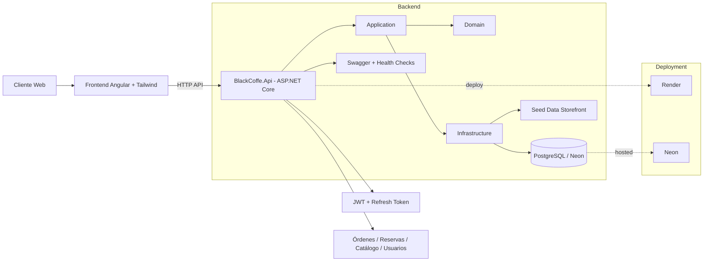

# Análisis del producto Black Coffe (estado actual + mejoras recomendadas)

## 1) Resumen ejecutivo
Black Coffe ya tiene una base sólida de producto con separación clara entre backend (`ASP.NET Core`, `Domain/Application/Infrastructure`) y frontend (`Angular` + `Tailwind`), además de soporte de despliegue en Render + Neon.

En su estado actual, el proyecto está **bien encaminado para un MVP funcional** (catálogo, carrito, checkout, reservas, autenticación y administración básica), pero aún requiere mejoras para escalar en:

- robustez operativa (observabilidad, seguridad avanzada, pruebas automáticas),
- experiencia de usuario (flujo de compra y reservas más guiado),
- mantenibilidad (estandarización de documentación técnica y procesos de entrega).

## 2) Qué está bien logrado hoy

### Arquitectura y organización
- Backend organizado en capas (`Domain`, `Application`, `Infrastructure`, `Api`), lo que favorece mantenibilidad.
- Migraciones de base de datos presentes y estructura preparada para crecimiento.
- Módulos funcionales relevantes para el negocio de cafetería: menú/catálogo, pedidos, reservas, inventario, usuarios y storefront.

### Frontend y producto
- Frontend con páginas clave para un flujo comercial real: home, catálogo, carrito, checkout, login, perfil y reservas.
- Modelos y servicios separados por dominio (autenticación, carrito, órdenes, storefront), facilitando evolución.

### DevOps/Deploy
- Contenedor Docker y `render.yaml` disponibles.
- Guías para despliegue y configuración inicial en Neon.

## 3) Áreas de mejora prioritarias

### Prioridad alta (0-30 días)
1. **Pruebas automáticas mínimas**
   - Backend: tests de servicios críticos (órdenes, auth, reservas).
   - Frontend: pruebas de flujos base (login, agregar al carrito, checkout).
2. **Seguridad y control de acceso**
   - Revisión de políticas por rol y endurecimiento de endpoints administrativos.
   - Revisión de expiración/rotación de tokens y manejo de refresh tokens.
3. **Observabilidad básica**
   - Logging estructurado, trazabilidad por request-id y dashboard mínimo de errores.

### Prioridad media (30-60 días)
1. **Mejora UX del funnel de compra**
   - Validaciones más claras en checkout.
   - Estado de pedido visible para cliente.
2. **Gestión operativa para staff**
   - Mejoras en panel admin para estados de pedido, mesas y reservas.
3. **Calidad de datos de catálogo**
   - Reglas de consistencia para productos, categorías y stock.

### Prioridad estratégica (60-90 días)
1. **Métricas de negocio**
   - Conversión catálogo→carrito→checkout.
   - Ticket promedio, recompra, tasa de cancelación.
2. **Automatización CI/CD**
   - Pipelines con validaciones (build + test + análisis estático) antes de deploy.
3. **Escalabilidad funcional**
   - Cupones/promociones, programa de fidelización y notificaciones.

## 4) Diagrama de arquitectura (actual)



## 5) Diagrama de evolución recomendada (objetivo)

```mermaid
flowchart TD
    U[Usuarios] --> FE[Frontend Angular]
    FE --> API[API Gateway / ASP.NET Core API]

    API --> S1[Servicio Catálogo]
    API --> S2[Servicio Órdenes]
    API --> S3[Servicio Reservas]
    API --> S4[Servicio Auth/Usuarios]

    S1 --> DB1[(PostgreSQL)]
    S2 --> DB2[(PostgreSQL)]
    S3 --> DB3[(PostgreSQL)]
    S4 --> DB4[(PostgreSQL)]

    API --> OBS[Logs + Métricas + Alertas]
    API --> CACHE[Cache Redis (opcional)]
    API --> MQ[Cola/Eventos (opcional)]

    CI[CI/CD Pipeline] --> API
    CI --> FE
```

## 6) Plan de acción sugerido

### Sprint 1
- Definir KPIs técnicos y de negocio.
- Implementar suite mínima de pruebas automáticas.
- Estandarizar manejo de errores y logging.

### Sprint 2
- Mejorar UX de checkout/reservas.
- Endurecer seguridad en endpoints administrativos.
- Preparar panel operativo con estados en tiempo real.

### Sprint 3
- Activar métricas de embudo comercial.
- Implementar CI/CD completo con quality gates.
- Diseñar backlog de funcionalidades de crecimiento.

## 7) Conclusión
Black Coffe está en un punto muy bueno: ya resuelve el núcleo funcional del negocio. El siguiente salto de calidad está en pruebas, seguridad, observabilidad y optimización del embudo de compra.

Si ejecutas este plan en 90 días, el producto pasará de MVP sólido a una plataforma lista para crecer con menos riesgo técnico.
