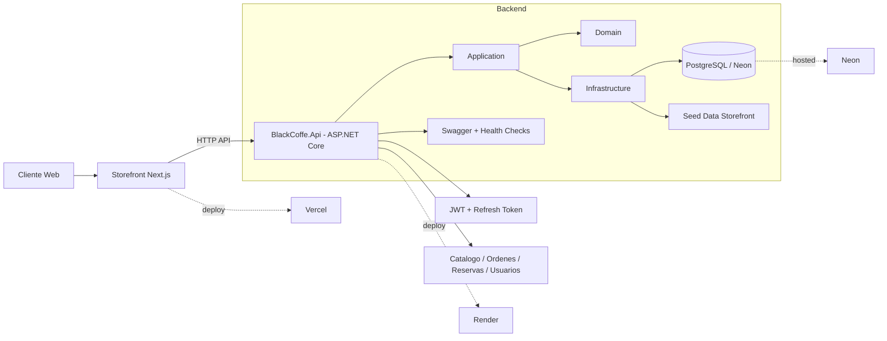

# Analisis del producto Black Coffe

## Resumen ejecutivo
Black Coffe queda estructurado con:
- `backend/` en ASP.NET Core con `Domain/Application/Infrastructure`
- `storefront-next/` en Next.js + Tailwind como storefront publico
- despliegue objetivo en `Render + Neon + Vercel`

El producto ya cubre el flujo comercial base:
- catalogo
- carrito
- checkout
- reservas
- autenticacion
- gestion inicial de storefront

El siguiente salto de calidad esta en:
- polish visual del hero y del funnel
- pruebas automatizadas
- observabilidad y endurecimiento de seguridad
- corte final ordenado de produccion al storefront nuevo

## Arquitectura actual

## Prioridades recomendadas
1. Terminar el polish visual del storefront nuevo y cerrar el cutover a Vercel.
2. Agregar pruebas de backend y de flujos criticos del storefront.
3. Mejorar observabilidad, CORS y configuracion de ambientes.
4. Retomar mejoras operativas para staff/admin despues del corte del storefront.

## Conclusión
La base tecnica ya es suficientemente solida para operar como MVP serio. La prioridad actual no es rehacer arquitectura, sino cerrar bien el storefront nuevo, cortar produccion sin ruido y seguir con calidad de entrega.
